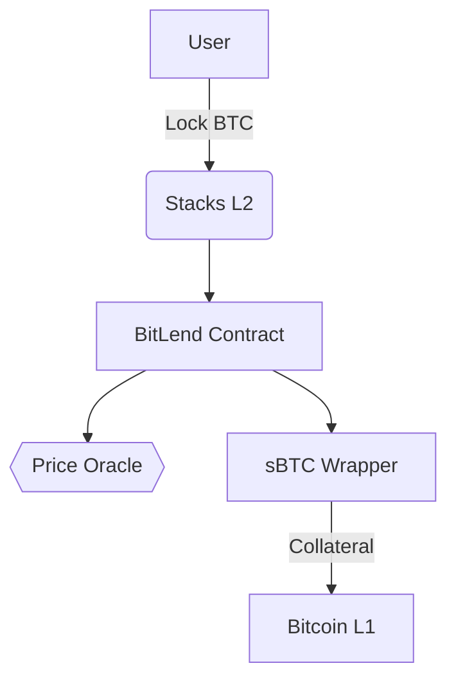

# BitLend Protocol Documentation

**Version 1.0.0**  
_A Bitcoin-Secured Decentralized Lending System_

## 1. Protocol Overview

BitLend is a non-custodial lending protocol that enables decentralized finance operations while preserving Bitcoin exposure. Built on Stacks Layer 2, it combines Bitcoin's security with advanced DeFi capabilities through auditable Clarity smart contracts.

### Key Innovations

- **Bitcoin-Centric Design**: First lending protocol using native BTC collateral via sBTC
- **Predictable Execution**: Utilizes Clarity's decidable smart contract language
- **Hybrid Security Model**: Inherits Bitcoin's proof-of-work security through Stacks blocks
- **Anti-Manipulation Protections**:
  - Price deviation checks (max 20% change per update)
  - Overflow/underflow protection on all arithmetic operations
  - Time-locked oracle updates

## 2. Technical Specifications

### 2.1 Core Parameters

| Parameter                | Value  | Description                       |
| ------------------------ | ------ | --------------------------------- |
| Minimum Collateral Ratio | 125%   | 1.25x loan value                  |
| Loan-to-Value (LTV)      | 70%    | Maximum borrow against collateral |
| Base Interest Rate       | 5% APR | Annual percentage rate            |
| Liquidation Penalty      | 10%    | Collateral bonus for liquidators  |
| Price Oracle Deviation   | 20%    | Max allowed price change          |

### 2.2 System Architecture

**Layer 1:** Bitcoin settlement (Stacks block anchors)  
**Layer 2:**

- Clarity smart contracts
- sBTC collateral pools
- Oracle consensus network
- Transaction batcher



## 3. Core Mechanics

### 3.1 Collateral Management

**Deposit Requirements:**

- Minimum: 0.001 BTC
- Maximum: Protocol liquidity cap

**Withdrawal Constraints:**

```clarity
(asserts! (>= new-collateral-value (* borrowed-amount 1.25))
```

### 3.2 Loan Operations

**Interest Calculation:**  
`Accrued Interest = (Principal × Rate × Blocks) / 31,536,000`  
_(31536000 blocks = 1 year at 10min/block)_

**Borrow Limits:**

```python
max_borrow = (btc_price × collateral_amount × 0.7) / liquidation_threshold
```

### 3.3 Liquidation Process

**Trigger Conditions:**

1. Collateral value < 125% loan value
2. Price deviation > 20% threshold
3. Protocol-wide safety module activation

**Liquidation Math:**  
`Seized Collateral = (Repaid Amount × 110%) / BTC Price`

## 4. Security Model

### 4.1 Contract Safeguards

- **Arithmetic Checks**
  ```clarity
  (asserts! (>= new-collateral current-collateral) (err u113))
  ```
- **Reentrancy Protection**: Atomic state changes
- **Oracle Fail-Safes**:
  - Price staleness check (max 6 blocks)
  - Multi-sig update requirements

### 4.2 Risk Parameters

| Risk Factor        | Mitigation Strategy          |
| ------------------ | ---------------------------- |
| BTC Volatility     | 125% over-collateralization  |
| Oracle Failure     | Circuit breaker mode         |
| Interest Rate Risk | Adaptive rate algorithm (v2) |
| Liquidity Crunch   | Protocol-owned reserves      |

## 5. Developer Guide

### 5.1 Contract Interfaces

**Key Functions:**

```clarity
;; Collateral Management
(define-public (deposit-collateral (amount uint))
(define-read-only (get-health-factor (user principal))

;; Loan Operations
(define-public (borrow (amount uint))
(define-public (repay (amount uint))

;; System Administration
(define-public (update-btc-price (new-price uint))
```

### 5.2 Integration Points

1. Price Oracle Feed (`update-btc-price`)
2. sBTC Wrapper Contract
3. Stacks Blockchain Explorer
4. Liquidator Bot API

## 6. Economic Model

### 6.1 Protocol Incentives

| Role        | Incentive Mechanism        |
| ----------- | -------------------------- |
| Borrowers   | Fixed-rate loans           |
| Lenders     | Interest-bearing positions |
| Liquidators | 10% collateral bonus       |
| Oracles     | STX-based rewards          |

### 6.2 Fee Structure

- **Borrowing Fee**: 0.25% of loan amount
- **Liquidation Fee**: 10% of collateral seized
- **Protocol Reserve**: 20% of fees collected

## 7. Audit & Verification

### 7.1 Formal Verification

- Clarity type system guarantees
- Arithmetic overflow proofs
- State transition validations
